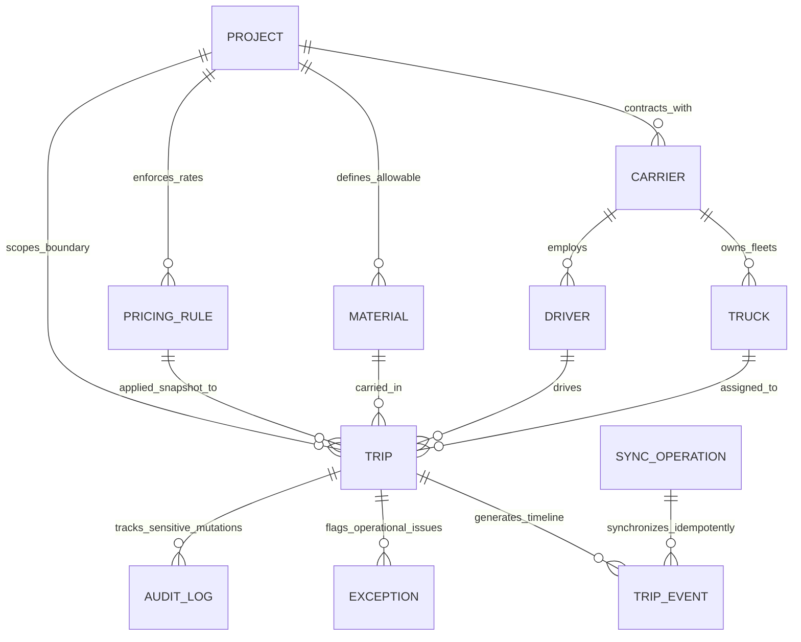

# Q Saudi Work Follow — النظام المعماري الشامل (Architecture Specification)

## 1. نبذة عامة والرؤية المعمارية (System Vision & Overview)

مشروع **Q Saudi Work Follow** هو منصة رقمية سحابية متقدمة (Full-Stack Multi-Project Logistics & Dispatch Management Platform) صُممت خصيصاً لإدارة عمليات النقل الثقيل وسلاسل إمداد المواد الإنشائية واللوجستية في المملكة العربية السعودية.

تم تصميم النظام ليعمل بكفاءة عالية في بيئات العمل الميدانية القاسية التي تتسم بضعف أو انقطاع شبكات الاتصال (Desert & Remote Sites)، مع الامتثال الصارم للضوابط التشغيلية والمحاسبية والتنظيمية (الهيئة العامة للنقل - منصة وصل/نقل، وهيئة الزكاة والضريبة والجمارك ZATCA).

---

## 2. المبادئ الإلزامية الصارمة (The 12 Invariant Architectural Principles)

تخضع جميع مكونات النظام بدون أي استثناء لـ 12 مبدأ معمارياً صارماً:

| # | المبدأ المعماري | الوصف والتطبيق الفني |
|---|---|---|
| **1** | **Firestore هو Source of Truth للعمليات** | قاعدة بيانات NoSQL الموزعة Firestore هي المصدر الأوحد والنهائي للحقيقة لكافة السجلات والعمليات اللوجستية والحالات والمقاييس. |
| **2** | **Google Sheets هو Operational/Reporting Projection** | جداول Google Sheets تعمل كإسقاط بياني (Read/Reporting Projection) لفرق العمليات ومسؤولي المتابعة بدون التأثير على صحة البيانات الأساسية. لا يُسمح للقراءة من الشيت لتعديل حالة النظام. |
| **3** | **Google Drive لتخزين ملفات المشروع والتقارير** | ملفات بوالص الشحن (Waybills)، وصور تذاكر الموازين (Weighbridge Slips)، ومستندات الفحص، وتقارير PDF الشهرية تُحفظ في مجلدات هرمية منظمة ومحمية على Google Drive. |
| **4** | **جميع Business Rules على Server-Side** | قواعد العمل، والتحقق من صحة الانتقال بين الحالات، وضوابط الحمولات، واحتساب الضرائب، تُنفذ حصرياً داخل خادم Node.js / Cloud Functions الآمن. |
| **5** | **Client لا يقرر Status النهائي** | العميل (Web/PWA) يرسل فقط "طلبات أحداث" (`Request Transition Event`). الخادم هو الكيان الوحيد المخول باعتماد التغيير وتحديث `trip.status`. |
| **6** | **Client لا يحسب القيمة المالية النهائية** | الحسابات المالية، والتعريفات، وغرامات التأخير (Demurrage)، وضريبة القيمة المضافة (15% VAT) تُحسب خادمياً بواسطة محرك التسعير (Server-Side Pricing Engine). |
| **7** | **Client لا يحدد Project Access** | صلاحيات المشاريع تُدار عبر Firebase Custom Claims و Security Rules الخادومية؛ لا يمكن للعميل تزوير أو تجاوز نطاق مشروعه المعتمد. |
| **8** | **لا توجد كلمات مرور أو API Secrets داخل Client** | مفاتيح Google Service Accounts، وأسرار التشفير، ومفاتيح API السرية موجودة حصراً في بيئة الخادم المشفرة (`process.env`). |
| **9** | **جميع عمليات الكتابة Idempotent** | كل طلب مزامنة أو تعديل يحمل `clientUUID` فريد و `idempotencyKey`، مما يضمن معالجة الطلب مرة واحدة بالضبط وتفادي التكرار عند إعادة المحاولة. |
| **10** | **النظام Multi-Project** | عزل كامل للبيانات والسجلات والمستندات على مستوى المشاريع (`tenant/project isolation`)، مع دعم مقاولين ناقلين متعددي المشاريع. |
| **11** | **النظام Offline-First** | واجهة PWA معتمدة على IndexedDB لتخزين البيانات المرجعية وقائمة الانتظار المحلية للعمليات (Local Mutation Queue)، مع مزامنة خلفية تلقائية فور توفر الشبكة. |
| **12** | **سجل تدقيق Audit Log لكل التغييرات الحساسة** | سجل غير قابل للتعديل (Immutable Append-Only Log) يوثق الفاعل، التوقيت، الفروقات (Diffs)، ورقم المعاملة لأي تعديل مالي أو تشغيلي أو استثناء. |

---

## 3. شرح العلاقات الشاملة بين كيانات النطاق (Core Domain Relationships)

يتمحور النظام حول العلاقات الوظيفية والبيانات الدقيقة بين 11 كياناً أساسياً:



### تفصيل العلاقات الوظيفية الدقيقة:

1. **المشروع (Project):**
   * يمثل الكيان الجذري التشغيلي والحدود المالية (Tenant Boundary).
   * يرتبط بعقود مع مقاولين ناقلين متعددين (**Carriers**).
   * يحدد المواد المسموح بنقلها (**Materials**) ونطاق الأسعار المعتمدة (**Pricing Rules**).
   * تتبع له جميع الرحلات (**Trips**) وسجلات التدقيق (**Audit Logs**) ومجلدات Google Drive المخصصة.

2. **الناقل / مقاول النقل (Carrier):**
   * شركة أو مؤسسة نقل معتمدة متعاقدة مع المشروع لنقل المواد.
   * يمتلك أسطولاً من الشاحنات (**Trucks**) ويوظف سائقين مؤهلين (**Drivers**).
   * ترتبط به قواعد تسعير تعاقدية معينة قد تختلف من ناقل لآخر بناءً على شروط العقد.

3. **قاعدة التسعير (Pricing Rule):**
   * مصفوفة خادومية تحدد كيفية تسعير الحمولة:
     * سعر الطن (Per Ton).
     * سعر الرد / المشوار (Per Trip).
     * سعر الكيلومتر (Per Km).
     * أجور الانتظار والتأخير (Demurrage Rates).
   * ترتبط بالمشروع والمادة ونوع الشاحنة، وتُؤخذ منها لقطة تاريخية (`Pricing Snapshot`) في لحظة اعتماد الرحلة لضمان ثبات القيمة المالية حتى لو تغيرت القاعدة مستقبلاً.

4. **المادة (Material):**
   * المادة المنقولة (مثل: كتل صخرية، رمل ناعم، بيس كورس Base Course، أسفلت، بحص Aggregates).
   * تحدد الكثافة القياسية، والحد الأقصى للرطوبة، ونوع الشاحنة المطابق لنقلها.
   * ترتبط مباشرة بالرحلة (**Trip**) لتحديد الموازين وقواعد الفحص والتسعير.

5. **الشاحنة (Truck):**
   * المركبة المادية التابعة للناقل (قلاب، تريلا، سطحة، بوري)، موثقة برقم اللوحة ورقم الهيكل.
   * مسجلة بوزنها الفارغ المعتمد رسميًا (**Tare Weight**) وحمولتها القانونية القصوى (**Max Legal Payload**).
   * يتم التحقق منها خادومياً قبل إطلاق أي رحلة لضمان سريان الفحص الدوري ووثيقة التأمين ورخصة السير.

6. **السائق (Driver):**
   * السائق المعتمد التابع للناقل والمخول بقيادة الشاحنة.
   * موثق برقم الهوية الوطنية أو الإقامة ورقم رخصة القيادة ورقم الجوال.
   * يرتبط بجلسة تطبيق PWA في الميدان لتسجيل الأحداث التشغيلية والتقاط صور التذاكر.

7. **الرحلة (Trip):**
   * الوحدة التشغيلية والمحاسبية الأساسية في النظام.
   * تجمع في نقطة زمنية ومكانية محددة: **المشروع + الناقل + الشاحنة + السائق + المادة + قاعدة التسعير**.
   * تمر بدورة حياة صارمة (State Machine) من الإنشاء إلى الإتمام المعتمد.

8. **أحداث الرحلة (Trip Event):**
   * تدفق زمني غير قابل للتعديل (Append-Only Event Stream) يوثق كل مرحلة للرحلة:
     * `DISPATCHED` -> `ARRIVED_LOADING` -> `WEIGHBRIDGE_IN` -> `LOADED` -> `EN_ROUTE` -> `ARRIVED_SITE` -> `WEIGHBRIDGE_OUT` -> `OFFLOADED` -> `COMPLETED`.
   * يتضمن الطابع الزمني الموثوق (Server Timestamp)، إحداثيات GPS، هوية المستخدم المُسجل، وبيانات الميزان (وزن إجمالي Gross، وزن فارغ Tare، وزن صافي Net).

9. **الاستثناء التشغيلي (Exception):**
   * حالة خلل أو انحراف عن المسار القياسي تتطلب تدخلاً إدارياً:
     * زيادة الوزن القانوني (Overload Exception).
     * اختلاف المادة عند الوصول (Material Mismatch).
     * عطل شاحنة في الطريق (Breakdown Exception).
     * تجاوز وقت الرحلة المسموح (Demurrage / Delay).
   * يوقف اكتمال الرحلة حتى يتم اعتماد حل رسمي أو تسوية من قِبل المشرف الميداني المعتمد.

10. **سجل التدقيق (Audit Log):**
    * السجل الأمني والمحاسبي غير القابل للحذف أو التعديل (Tamper-evident Audit Ledger).
    * يسجل أي تغيير على البيانات الحساسة (تعديل ميزان، تجاوز استثناء، تحديث قاعدة تسعير، إعادة احتساب مالي، أو تعيين صلاحيات).

11. **عملية المزامنة (Sync Operation):**
    * الحاوية الذاتية (Idempotent Sync Envelope) التي تضمن وصول وتطبيق العمليات التي تمت في وضع عدم الاتصال (Offline).
    * تحمل معرّف المعاملة الفريد، والبيانات الميدانية، وتدير إعادة المحاولة والتأكد من مطابقة السجلات خادومياً دون ازدواجية.

---

## 4. المخطط المعماري للطبقات (Architectural Tiers & Topology)

```
+-----------------------------------------------------------------------------------+
|                           CLIENT TIER (PWA & Field Apps)                          |
|  - React 19 + TypeScript + Tailwind CSS                                           |
|  - Service Worker (Offline Caching & App Shell)                                   |
|  - IndexedDB (Master Local Replica, Mutation Queue, Pending Events)               |
|  - Sync Manager (Background Sync Engine with Idempotency UUIDs)                   |
+-----------------------------------------------------------------------------------+
                                         │
                 HTTPS / REST / WebSocket (Authorized with Bearer Token)
                                         ▼
+-----------------------------------------------------------------------------------+
|                        AUTHORITATIVE BACKEND TIER (Node.js)                       |
|  - Node.js + Express + TypeScript Core Engine                                     |
|  - Firebase Admin SDK (Auth Token Verification & Claims Enforcement)              |
|  - State Transition Engine (Deterministic FSM validating Trip status)             |
|  - Server-Side Pricing Engine (SAR calculations, 15% VAT, Demurrage)              |
|  - Multi-Project Context Middleware (Tenant isolation & verification)             |
|  - Idempotency & Conflict Resolution Interceptor                                  |
|  - Audit Log Collector (Immutable trail logging)                                  |
+-----------------------------------------------------------------------------------+
                     │                                     │
                     ▼                                     ▼
+------------------------------------+   +-----------------------------------------+
| PRIMARY SOURCE OF TRUTH (Database) |   | PROJECTION & ASSET SERVICES (Async/Queue)|
|  - Google Cloud Firestore (KSA DC) |   |  - Google Sheets API (Reporting Proj.)  |
|  - Multi-Tenant Collections        |   |  - Google Drive API (Folder Hierarchy)  |
|  - ACID Batched Writes & Runs      |   |  - ZATCA Compliant Archival Worker      |
+------------------------------------+   +-----------------------------------------+
```

---

## 5. هيكلية التدفق البياني للبيانات (Data Flow Sequences)

### 5.1 دورة حياة تسجيل الرحلة وتأكيد الوصول (Dispatch to Completion):

1. **الطلب الميداني:** السائق أو مشرف الميزان يضغط "تسجيل وزن الانطلاق".
2. **المعالجة المحلية:** يُخزن الحدث في IndexedDB مع توليد `idempotencyKey = uuidv4()`.
3. **الإرسال الخادومي:** ترسل الحزمة إلى الخادم مصحوبة برمز التعريف `Bearer <Firebase_ID_Token>`.
4. **التحقق الخادومي:**
   - فحص صحة المستخدم وصلاحيته بالمشروع (`X-Project-Id`).
   - فحص عدم تكرار `idempotencyKey` في `sync_operations`.
   - فحص مطابقة قواعد الحالة السابقة مع الحالة الجديدة.
5. **الالتزام في الحقيقة (Source of Truth):**
   - تنفيذ Firestore Transaction لتسجيل `TripEvent`، تحديث `Trip`، وتحديث سجل التدقيق.
6. **الإسقاط غير المتزامن (Asynchronous Projections):**
   - تشغيل Worker لإضافة سطر في Google Sheet الخاص بالمشروع.
   - رفع صورة تذكرة الميزان إلى مجلد Google Drive المرتبط بالمشروع وتخزين المعرف `driveFileId`.
7. **إشعار العميل:** إرجاع الاستجابة المكتملة إلى تطبيق PWA لتحديث IndexedDB بحالة `SYNCED`.
