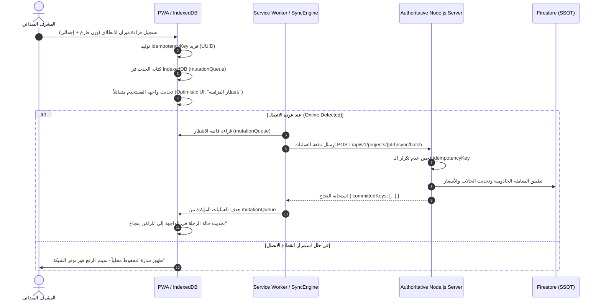

# Q Saudi Work Follow — نموذج العمل بدون اتصال والمزامنة الميدانية (Offline & Sync Model)

## 1. التحديات الميدانية والدافع المعماري (Field Challenges in KSA)

تعمل شاحنات النقل الثقيل ومواقع الكسارات والردميات في مناطق صحراوية نائية في المملكة (مثل مسارات الدهناء، رماح، نفود السر، مواقع التعدين، ومشاريع البنية التحتية العملاقة). هذه البيئات تعاني من:
* انقطاع متكرر لشبكات الجيل الرابع والخامس (Cellular Dead Zones).
* عدم استقرار سرعة الإنترنت وتذبذب فترات الاتصال.
* الحاجة لتسجيل حركة مئات الشاحنات وتذاكر الموازين دون أي توقف أو تعطيل لسير العمل.

لذلك، صُمم **Q Saudi Work Follow** كمنصة **Offline-First PWA** أصيلة، حيث يمكن للتطبيق إتمام دورة حياة التسجيل والتوثيق محلياً 100%، ثم مزامنتها تلقائياً وبشكل موثوق فور التقاط أي إشارة اتصال.

---

## 2. الهيكلية التخزينية المحلية (IndexedDB Local Architecture)

تستخدم الواجهة الأمامية قاعدة بيانات المتصفح **IndexedDB** وتُقسم إلى 4 مستودعات رئيسية (`Object Stores`):

```
IndexedDB: "QSaudiWorkFollowDB" (v1)
 ├── 1. "metadataCache"         (البيانات المرجعية المحدثة دورياً)
 ├── 2. "activeTrips"           (الرحلات النشطة والجارية الخاصة بالمشروع)
 ├── 3. "mutationQueue"         (قائمة انتظار العمليات والأحداث الميدانية المعلقة)
 └── 4. "syncStatus"            (سجل تتبع حالة المزامنة ومؤشرات التزامن)
```

### تفاصيل مستودعات IndexedDB:

#### 1. مستودع `metadataCache`:
* **المحتوى:** قائمة الناقلين المعتمدين، الشاحنات، السائقين، المواد، وتعاريف الموازين الخاصة بالمشروع النشط.
* **سياسة التحديث:** Stale-While-Revalidate عند توفر الشبكة، مع صلاحية محلية تمتد لـ 24 ساعة لتمكين العمل دون اتصال دائم.

#### 2. مستودع `activeTrips`:
* **المحتوى:** لقطة محلية للرحلات الجارية التي تخص المحطة أو المشرف الميداني لتوفير قراءة فورية سريعة.

#### 3. مستودع `mutationQueue` (شريان العمليات الميدانية):
* كل عملية ينفذها المستخدم في وضع عدم الاتصال تُغلّف في كائن طفرة (`Mutation Envelope`):
```typescript
interface OfflineMutation {
  id: string;                         // UUIDv4 محلي
  idempotencyKey: string;             // مفتاح الحماية من التكرار
  projectId: string;
  tripId: string;
  operationType: 
    | 'DISPATCH_TRIP'
    | 'RECORD_WEIGHBRIDGE_ORIGIN'
    | 'RECORD_WEIGHBRIDGE_DEST'
    | 'OFFLOAD_CARGO'
    | 'RAISE_EXCEPTION';
  payload: Record<string, any>;
  deviceTimestamp: string;            // التوقيت المحلي للجهاز (ISO)
  retryCount: number;
  status: 'QUEUED' | 'SENDING' | 'SYNCED' | 'FAILED_RETRYABLE' | 'REJECTED';
  errorMessage?: string;
  createdAt: number;                  // Date.now()
}
```

#### 4. مستودع `syncStatus`:
* يحتوي على توقيت آخر مزامنة ناجحة، وعدد العمليات المعلقة في الطابور، ومؤشر الاتصال الشبكي.

---

## 3. دورة حياة العملية في وضع عدم الاتصال (Mutation Lifecycle Flow)



---

## 4. سياسة فض النزاعات والمطابقة (Conflict Resolution Strategy)

* **السيادة التامة للخادم (Server-Authoritative Reconciliation):**
  الخادم هو المرجع الأوحد لقبول أو رفض أي انتقال في حالة الرحلة. لا يُقبل انتقال حالة غير منطقي (مثلاً: محاولة تسجيل تفريغ شحنة لرحلة تم إلغاؤها على الخادم).
* **معالجة انحراف توقيت الأجهزة (Clock Skew Handling):**
  نظراً لاحتمال وجود خلل في ضبط ساعات أجهزة الهواتف الميدانية:
  1. يُحفظ `deviceTimestamp` كمرجع استرشادي لتسلسل الأحداث الميدانية.
  2. يعتمد النظام دائماً على `serverTimestamp` الخادومي كطابع زمني رسمي للأثر القانوني والفوترة وحساب غرامات التأخير.
* **الترتيب المنطقي للأحداث (Domain Event Sequencing):**
  عند مزامنة عدة أحداث لنفس الرحلة تمت دون اتصال، يفرز الخادم الأحداث بحسب تسلسلها المنطقي لدورة حياة الرحلة وليس فقط بناءً على وقت الجهاز.

---

## 5. إدارة الصور والوثائق الميدانية (Offline Document Attachments)

* صور تذاكر الميزان الملتقطة بالكاميرا يتم ضغطها محلياً في المتصفح باستخدام `Canvas Web API` لتقليل الحجم إلى أقل من 500KB مع الحفاظ على وضوح أرقام الأوزان والختم.
* تُخزن الصورة محلياً في IndexedDB كـ `Blob` مرتبط بـ `idempotencyKey`.
* عند استعادة الاتصال، تُرفع الصورة أولاً إلى نقطة النهاية المخصصة في الخادم، ويتم إسناد `driveFileId` إلى سجل الرحلة، ثم تُحذف الصورة محلياً لتوفير مساحة تخزين الجهاز.
